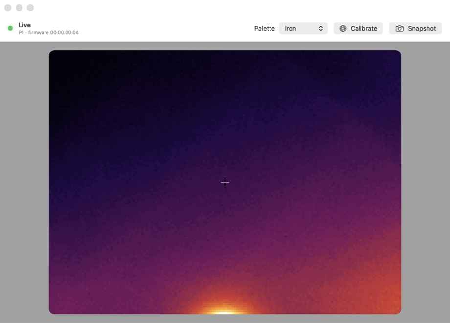

# Thermal Cam

[](https://github.com/johnboiles/thermal-cam/actions/workflows/ci.yml)

An open-source, native macOS viewer for USB thermal cameras. Thermal Cam is
brand-neutral by design: camera-specific USB transports and frame decoders plug
into a shared radiometric frame model and SwiftUI viewer.



## Supported cameras

| Camera | USB ID | Resolution | Frame rate | Status |
|---|---|---:|---:|---|
| Thermal Master P1 | `3474:45C2` | 160 × 120 | ~25 fps | Live hardware verified |

The P1 is the first supported camera, not the identity of the application.

## Install

```sh
brew install --cask johnboiles/tap/thermal-cam
```

You can also download the signed and notarized app from
[GitHub Releases](https://github.com/johnboiles/thermal-cam/releases/latest).

## Build the app

Requirements:

- macOS 15 or later
- Xcode 26.4 or later / Swift 6 (for the native layered app icon)
- Homebrew `libusb` (`brew install libusb`)

Run:

```sh
./scripts/build-app.sh
open "dist/Thermal Cam.app"
```

The build script embeds `libusb` in the app bundle, so the resulting app can be opened without setting a library path.

## Controls

- Hover over the image for a per-pixel temperature.
- Choose Iron, Inferno, White Hot, Black Hot, or Rainbow palettes.
- Calibrate triggers the camera's shutter/NUC correction.
- Snapshot saves the visible thermal image as PNG (`⌘S`).

The footer shows minimum, center, and maximum measured temperatures plus live frame rate.

## Adding a camera

Camera support is isolated behind `ThermalCameraDriver`. A new camera normally
needs a transport/decoder pair and one factory entry in `ThermalCameraRegistry`;
the palettes, temperature overlays, snapshots, and UI are resolution-independent.
See [`docs/ADDING_A_CAMERA.md`](docs/ADDING_A_CAMERA.md).

## Releases

Tagged releases are Developer ID signed, notarized, stapled, and published with
a SHA-256 checksum. See [`docs/RELEASING.md`](docs/RELEASING.md).

## Project layout

- `Sources/ThermalCore` — generic driver contract, camera registry, frames, palettes, and model-specific drivers
- `Sources/ThermalCam` — brand-neutral SwiftUI app and capture controller
- `Tests/ThermalCoreTests` — synthetic frame and palette tests
- `docs/P1_PROTOCOL.md` — P1 reverse-engineering notes and provenance
- `research/` — ignored local copies of APK/open-source research inputs

## Notes

The current P1 driver uses `libusb` because that camera does not expose a standard
AVFoundation video stream. Future drivers can use a different transport while
producing the same `ThermalFrame` type.

Thermal Master is a trademark of its respective owner. This independent interoperability project is not affiliated with or endorsed by Thermal Master Technology.
